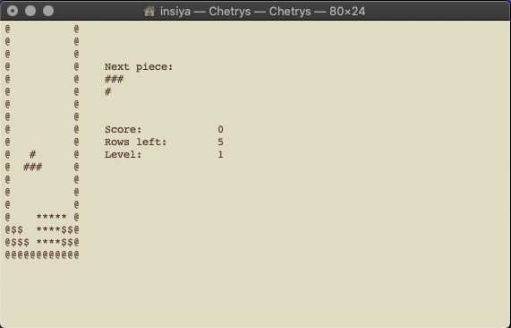
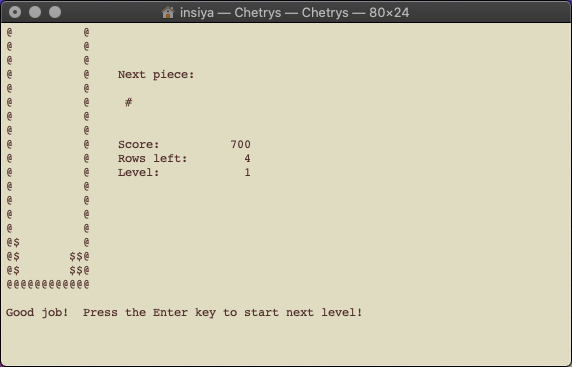

# Chetrys

Chetrys is a Tetris knockoff coded in C++ that can be played in the MacOS Terminal. (Sorry Windows users!) 
I developed Chetrys on my own in February and March of 2018 for a class project. 

## History

This is a modified version of my submission for Project 3 from when I took UCLA's COM SCI 32: Intro to Computer Science II, taught by David Smallberg in Spring 2018. This assignment taught me how to use object-oriented programming to build a rather large project. 

I'm really proud of what I accomplished, and now looking back a few years later, this project serves as a reminder that I'm more than capable of creating something cool with code. 

## How to Play

First, download the Chetrys executable file. Double-click the file to open it in Terminal. Click `Enter` to start playing!



Use the `left` and `right` arrow keys to move the pieces left and right, the `up` arrow key to rotate the piece clock, and the `down` arrow key to move the piece down faster. You can also press the spacebar to drop the piece down to the bottom of the well immediately. To quit a game, click `q`. 

Each level starts off with an empty well. Clear a specified number of rows to complete levels. The number of rows you have left to complete to reach the next level will be shown on the right hand side of the screen. Once you complete a level, hit `Enter` to start the next one. How many levels can you complete?



## Special Pieces

Along with your standard Tetris pieces, there are a few Easter eggs thrown into the mix. 

### Vapor Bomb
```
##
```
This piece will vaporize surrounding blocks and clear away debris. Use it to clear away taller blocks or open up hard to reach spots!

### Foam Bomb
```
#
```
This piece will fill in the surrounding area with foam, helping you to clear rows faster. Use it to reach and fill in tight spaces!

### Crazy Piece
```
 #
#
#
 #
```
When you click the left arrow key, it moves right. When you click the right arrow key, it moves left. How confusing!
